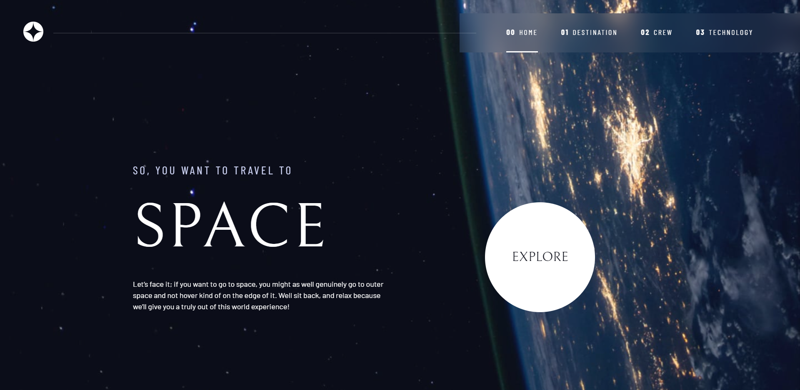
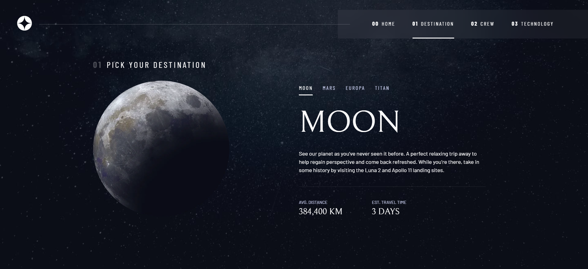
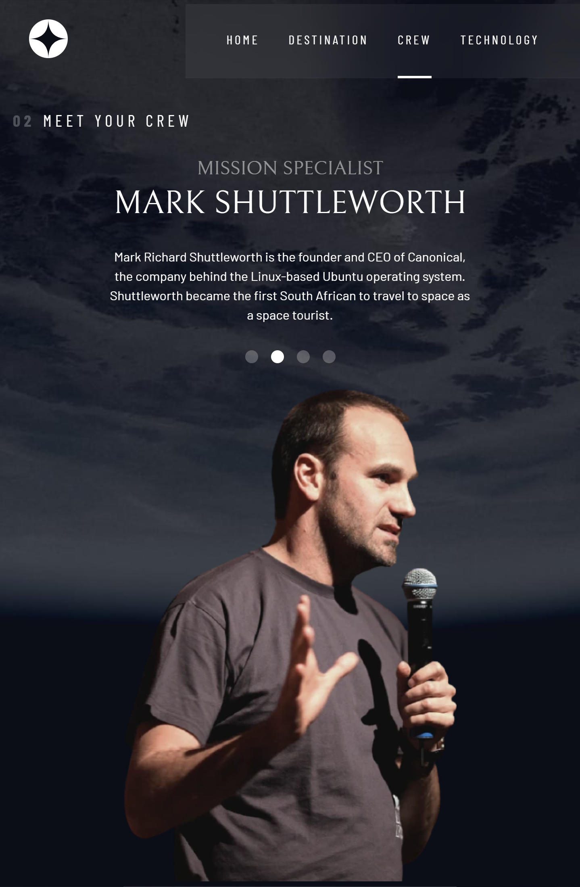
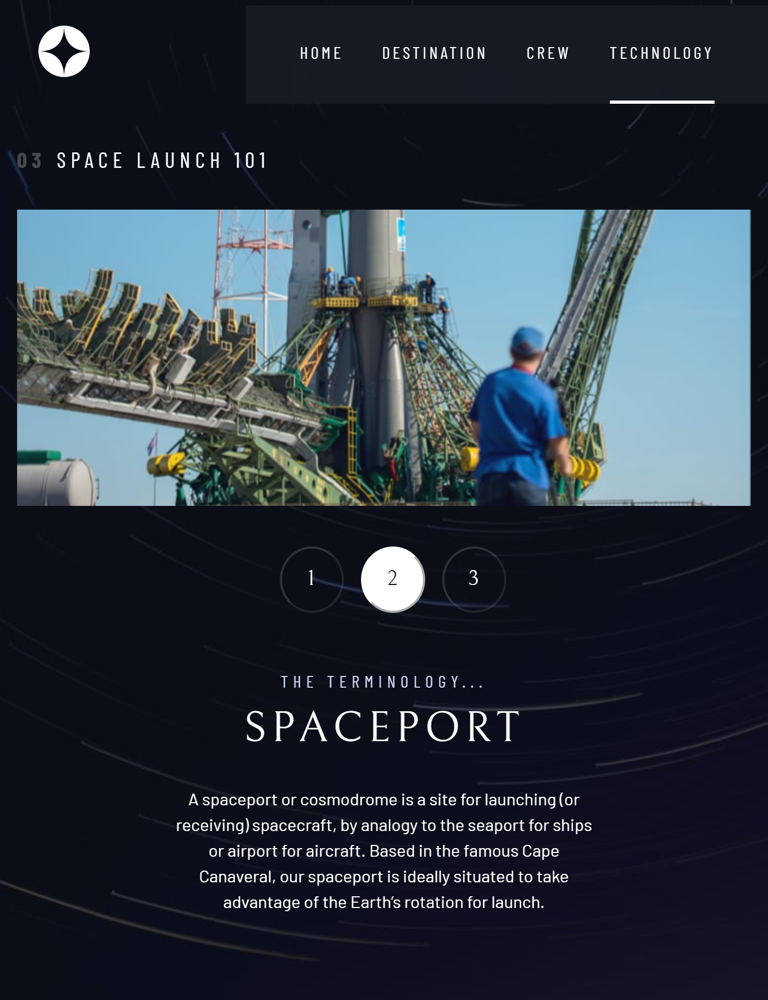
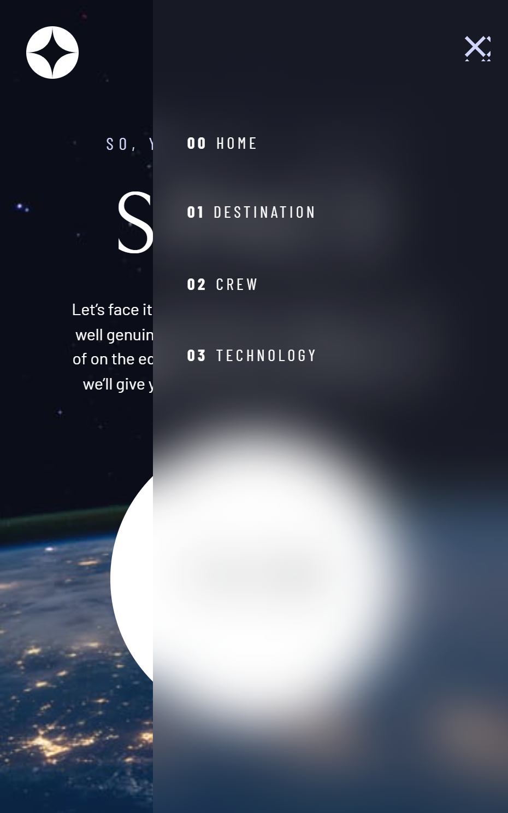
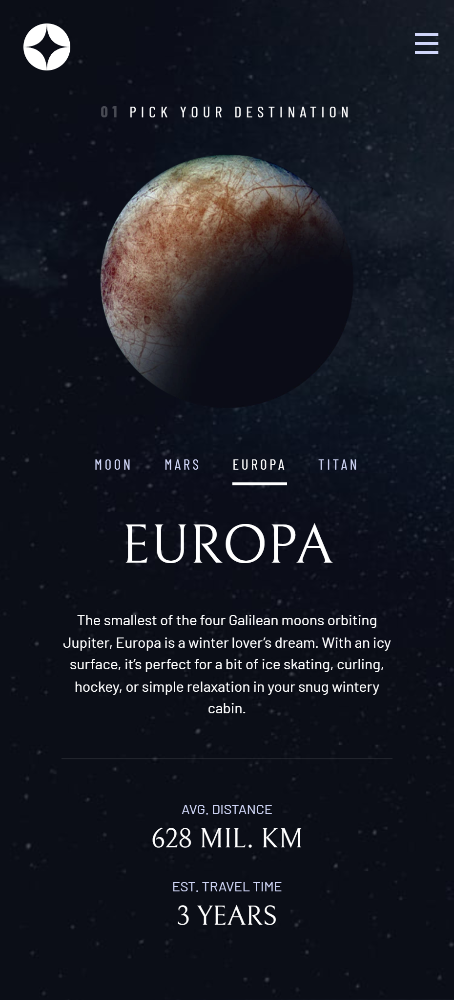
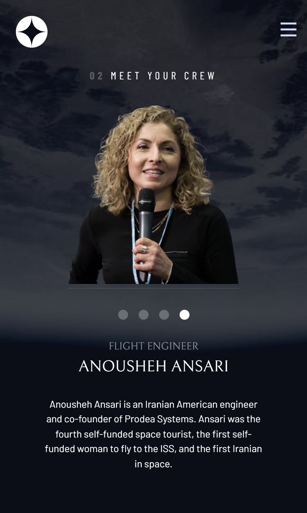
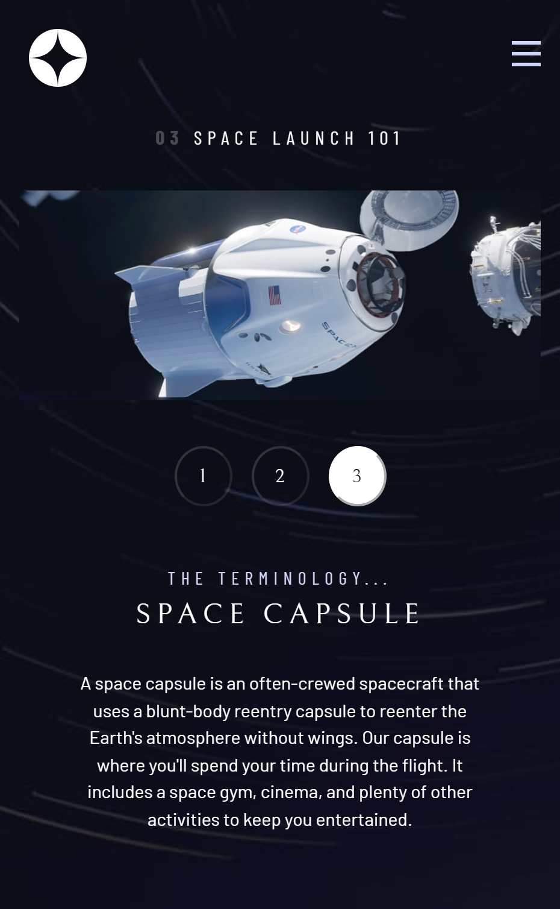

# Space Tourism Multipage Website

Challenge from [Frontend Mentor](https://www.frontendmentor.io/)

## Usage

The purpose of this project was to practice HTML, CSS and JavaScript skills with
a design from Frontend Mentor challenge

## Challenge Description

"This challenge will test your web development skills to build a multipage
website with responsive views!"

## Tech Stack

**Client:** HTML, CSS, JavaScript

## Authors

- [@haylzrandom - GitHub](https://www.github.com/haylzrandom)
- [@haylzrandom - Frontend Mentor](https://www.frontendmentor.io/profile/HaylzRandom)

## Acknowledgements

- [Space Tourism Multipage Website](https://www.frontendmentor.io/challenges/space-tourism-multipage-website-gRWj1URZ3)

## Roadmap

- [ ] Remake as a React App
- [ ] Utilise JSON file for data

## Related

Here are some related projects

- [Calculator App](https://github.com/HaylzRandom/calculator-app)
- [Advice Generator App](https://github.com/HaylzRandom/advice-generator-app)
- [Stats Preview Component](https://github.com/HaylzRandom/stats-preview-card-component)
- [Single Price Grid Component](https://github.com/HaylzRandom/single-price-component)
- [Ping Single Column Page](https://github.com/HaylzRandom/ping-single-column-page)

## Demo

## Screenshots

 
    <table>
        <thead>Desktop</thead>
        <tr>
            <td>
                
            </td>
            <td>
                
            </td>
        </tr>
    </table>

 
    <table>
        <thead>Tablet</thead>
        <tr>
            <td>
                
            </td>
            <td>
                
            </td>
        </tr>
    </table>

 
    <table>
        <thead>Mobile</thead>
        <tr>
            <td>
                
            </td>
            <td>
                
            </td>
            <td>
                
            </td>
            <td>
                
            </td>
        </tr>
    </table>

